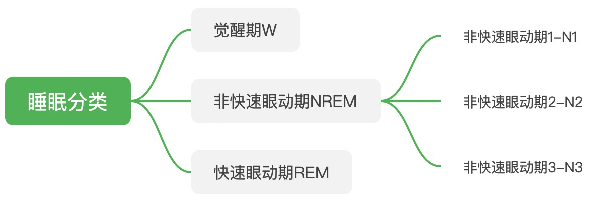
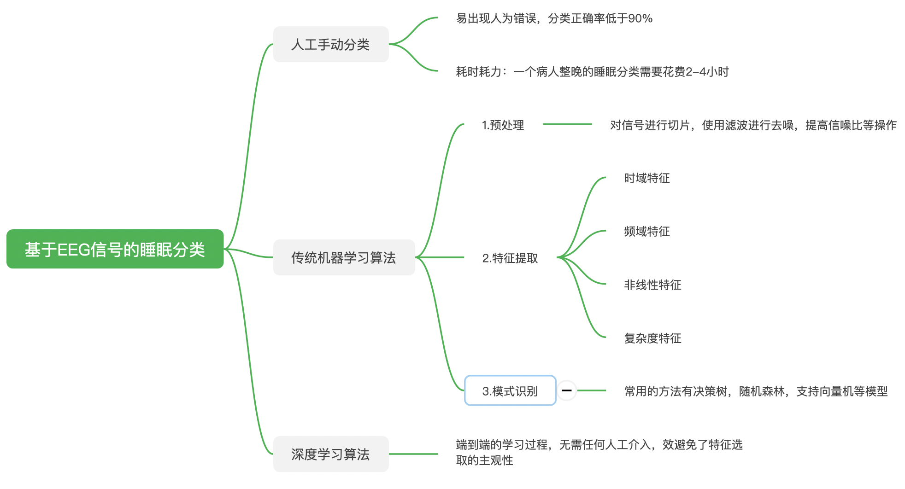

## 文献综述
### 1. 研究背景与意义
睡眠是人机体恢复和巩固的重要环节，并且会以各种方式影响人们的身体健康，对个人精神状态、学习能力和身体机能起着至关重要的作用[1-2]。根据2019年发布的《中国睡眠质量调查报告》，有83.81%的被调查者经常受到睡眠问题困扰，成年人失眠发生率高达38.2%,超过3亿中国人有睡眠障碍。根据丁香医生《2019国民健康洞察报告》，76%的公众受到的睡眠困扰是睡眠障碍。所以睡眠问题是一个很普遍的公共卫生问题。睡眠问题常常会引起各种睡眠相关疾病，目前常见的睡眠相关疾病有阻塞性睡眠呼吸暂停（Obstructive Sleep Apnea，OSA）和失眠症等，都对人身体健康造成很大的影响。文献[3]和[4]表明，90%以上的抑郁症患者都有睡眠障碍相关疾病。

在医学领域，睡眠分析是研究和诊断人睡眠相关疾病不可或缺的一环，是完成睡眠质量评估的前提[2]。而睡眠分类则是完成睡眠分析中最重要的一步，也是医学和研究人员分析睡眠最重要的工具。人的睡眠过程可以根据生物电信号分为不同的时期，比如R&K标准，将人睡眠分为六期（即 W,REM,S１,S２,S３,S４）。另外还有美国睡眠协会（AASM）2007年提出的AASM标准，标准中睡眠阶段重新分类为阶段 W（觉醒），阶段 N1-N3（非 REM）和阶段 R（REM），AASM标准如图0-1所示。

睡眠分类通常需要根据采集到的病人的整晚多导睡眠检测数据（Polysomnographic,以下简称PSG），然后让拥有睡眠研究经验的专家进行手动分类。通常，PSG信号包括脑电信号（Electroencephalogram，以下称EEG），眼电信号（Electrooculogram，EOG），肌电信号（ Electromyogram，EMG），心电信号（Electrocardiogram，ECG）。 PSG记录包括多个信号通道，由专家进行人工手动处理，对睡眠进行分类，不仅人力成本巨大，而且容易出现人为错误，往往繁琐且耗时。专家对一个病人的整晚睡眠进行分类通常需要花费2-4个小时，并且一些研究表明，专家人工手动分类的准确率往往低于90%[5]。此外，采集病人PSG信号需要让患者整晚佩戴多个相关仪器，会对人造成非常大的不适感。EEG信号在睡眠的人工手动分类和算法自动分类中都是最重要且最常用的信号，因此使用可穿戴的单通道EEG信号采集设备成为目前研究的主流[6]。

基于EEG信号的睡眠自动分类算法主要可以分成两类，一类是传统的机器学习方法，该方法需要信号处理手段对EEG信号进行预处理，再建立分类模型；二是深度学习方法，近年来深度学习技术取得了巨大的进步，特别是在图像处理领域。基于深度学习的医学影像处理技术，已经取得了巨大的应用，在器官CT图像分割识别上已经实现落地，方法快速、精确，对医生进行辅助性诊疗起到了很大的帮助。同样，深度学习技术也在生物信号处理领域有着非常大的应用价值[10]。

### 2. 国内外研究现状

从上世纪60年代开始就有研究人员利用计算机程序辅助睡眠分类[11]。经过几十年的发展，目前基于EEG信号的睡眠分类方法主要可以分为人工手动分类，机器学习算法，深度学习算法三类，如图0-2所示。

其中，基于机器学习算法和基于深度学习算法即为自动分类算法[1,2,7]。在机器学习算法中，通常需要使用传统的信号处理手段对原始的EEG信号进行降噪和特征提取，然后将提取到的特征参数作为睡眠自动分类机器学习模型的输入，模型从输入的特征中学习到睡眠特征和各个睡眠阶段的映射关系，最后依据两者的映射关系实现睡眠的自动分期，如图0-3(b)所示。该类方法比较依赖于睡眠特征的提取，准确的睡眠特征参数对模型的分期效果起着至关重要的作用[8]，并且需要针对不同的数据集进行人工特征设计。近年来，该类方法表现比较好的有Subasi等人在2018年提出一种结合主成成分分析（ICA）的集成支持向量机（SVM）模型，分类准确率达到91%[12]；Şen B提出使用不同维度的特征提取方法，并且通过实验使得应用特征选择算法的最优特征子空间训练的睡眠分类模型能够达到97%的准确率[2]，但该算法的预处理过程非常复杂；Jiang D等人在2019年提出一种多模态信号分解和特征提取策略处理单通道EEG信号，然后利用基于隐马尔可夫模型的无规则细化过程对睡眠进行分类，准确率达到93%[13];范文兵等人利用两层滤波器实现对原始EEG信号的去噪，后利用小波变换算法提取各睡眠阶段节律波特征，最后将所有获得的特征输入到反馈传播神经网络中，得到85.81%的平均准确率[14]。综上所述，机器学习算法的睡眠分类在合理化的设计EEG信号特征提取后能够达到非常有效的分类准确率。

基于深度学习的睡眠自动分类算法借助于深度神经网络进行自动特征提取，避免了特征选取的主观性，然后使用分类器进行睡眠自动分类（如softmax），可以达到非常好的效果。2018年Arnaud Sors等人利用一维卷积神经网络(Convolutional Neural Networks, CNN)[9]对原始单通道EEG信号进行睡眠分类，网络同时实现了EEG信号特征提取和睡眠分类，分类准确率可以达到87%；2019年Sajad Mousavi等人提出的SleepEEGNet[15]，利用CNNs提取单通道EEG信号的时不变特性和时域特征，然后利用SeqtoSeq模型捕获不同睡眠阶段复杂的长期和短期的变化关系，从而实现对睡眠的自动分类，整体准确率达到 84.26%；

需要改！！！！
Huy Phan等人在2019年提出的SeqSleepNet识别准确率为87.1%，该模型中作者把自动睡眠分阶的分类任务看成是一个序列对序列的分类任务，该序列对序列的分类任务可以在多个epochs后接收一个序列，然后一次性分类该序列的所有标签

。该模型不需要任何的手工特征提取的过程，实现了端到端的睡眠分类学习过程，并且提高了睡眠分类的精度，可以有效的提高睡眠分类的效率。所以基于深度学习的EEG信号处理方法是未来的趋势。

（**图0-3**）

### 参考文献
1. Aboalayon K A I, Faezipour M, Almuhammadi W S, et al. Sleep stage classification using EEG signal analysis: a comprehensive survey and new investigation[J]. Entropy, 2016, 18(9): 272.
2. Şen B, Peker M, Çavuşoğlu A, et al. A comparative study on classification of sleep stage based on EEG signals using feature selection and classification algorithms[J]. Journal of medical systems, 2014, 38(3): 18.
3. Aboalayon, K.A.; Faezipour, M. Multi-class SVM based on sleep stage identification using EEG signal. In Proceedings of the IEEE Healthcare Innovation Conference (HIC), Seattle, WA, USA, 8–10 October 2014; pp. 181–184.
4. Huang, C.-S.; Lin, C.-L.; Ko, L.-W.; Liu, S.-Y.; Sua, T.-P.; Lin, C.-T. A hierarchical classification system for sleep stage scoring via forehead EEG signals. In Proceedings of the IEEE Symposium on Computational Intelligence, Cognitive Algorithms, Mind, and Brain (CCMB), Singapore, 16–19 April 2013; pp. 1–5.
5. Hassan A R, Bashar S K, Bhuiyan M I H. On the classification of sleep states by means of statistical and spectral features from single channel electroencephalogram[C]//2015 International conference on advances in computing, communications and informatics (ICACCI). IEEE, 2015: 2238-2243.
6. Hassan A R, Bhuiyan M I H. Automatic sleep scoring using statistical features in the EMD domain and ensemble methods[J]. Biocybernetics and Biomedical Engineering, 2016, 36(1): 248-255.
7. 高群霞,周静,吴效明.基于脑电信号的自动睡眠分期研究进展[J].生物医学工程学杂志,2015,32(05):1155-1159
8. 何垣谛. 睡眠分期算法研究[D].电子科技大学,2019.
9. Sors A, Bonnet S, Mirek S, et al. A convolutional neural network for sleep stage scoring from raw single-channel EEG[J]. Biomedical Signal Processing and Control, 2018, 42: 107-114.
10. Min S, Lee B, Yoon S. Deep learning in bioinformatics[J]. Briefings in bioinformatics, 2017, 18(5): 851-869.
11. Itil T M, Shapiro D M, Fink M, et al. Digital computer classifications of EEG sleep stages[J]. Electroencephalography and clinical neurophysiology, 1969, 27(1): 76-83.
12. Alickovic E, Subasi A. Ensemble SVM method for automatic sleep stage classification[J]. IEEE Transactions on Instrumentation and Measurement, 2018, 67(6): 1258-1265.
13. Jiang D, Lu Y, Yu M A, et al. Robust sleep stage classification with single-channel EEG signals using multimodal decomposition and HMM-based refinement[J]. Expert Systems with Applications, 2019, 121: 188-203.
14. 范文兵,刘雪峰,赵艳阳.基于单通道脑电信号的自动睡眠分期[J].计算机应用,2017,37(S2):318-321.
15. Mousavi S, Afghah F, Acharya U R. SleepEEGNet: Automated sleep stage scoring with sequence to sequence deep learning approach[J]. PloS one, 2019, 14(5).

