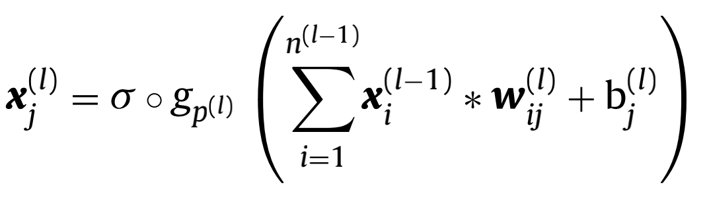

## 文献阅读记录
### 1. DeepSleepNet(翻译任务)
DeepSleepNet: a Model for Automatic Sleep Stage Scoring based on Raw Single-Channel EEG
#### DeepSleepNet:基于原始单通道EEG信号的睡眠自动分期模型
Akara Supratak, Hao Dong, Chao Wu, and Yike Guo*  
Department of Computing, Imperial College London, London.
(e-mail:{as12212, hao.dong11, chao.wu, y.guo}@ic.ac.uk

#### a.摘要
本研究提出了一种深度学习模型，名为DeepSleepNet，用于基于原始单通道EEG的睡眠阶段自动评分。现有方法大多依赖人工手动分层，需要具有睡眠分析的知识。其中只有少数人将过渡规则等时间信息编码提取到特征中，这对于识别下一个睡眠阶段非常重要。在所提出的模型中，我们利用卷积神经网络提取时不变特征，利用LSTM自动学习睡眠阶段之间的转换规则。我们实现了一个两步训练算法来有效地训练我们的模型.我们在两个不同的单通道EEG信号（ (F4-EOG(Left), Fpz-Cz and Pz-Oz)）数据集上验证了我们的模型，并且这两种数据集具有不同性质（例如，抽样率）和评分标准（分别为AASM 和 R&K）。结果表明我们的模型在两个数据集上能达到相似的准确率和宏F1-分数（macro F1-score）（MASS: 86.2%-81.7, Sleep-EDF: 82.0%-76.9），并且在两个数据集上都高于目前最先进的方法（(MASS: 85.9%-80.5,Sleep-EDF: 78.9%-73.7）。**这表明，在没有改变模型结构和训练方法的情况下，我们的模型可以自动学习来自不同数据集的原始单通道脑电信号的睡眠阶段的特征，而不需要使用任何手工干预。**

#### b.介绍
睡眠在人体健康上扮演者非常重要的角色。对人睡眠质量的检测在医学研究和实践上起着非常重要的作用。通常，睡眠专家使用附着在身体不同部位的传感器记录的电活动来确定睡眠质量。从传感器上获得的这类信号被称为多导睡眠图（PSG, polysomnogram），包括脑电图（EEG，electroencephalogram）、眼动电图（ electrooculogram，EOG）、肌动电图（electromyogram，EMG)和心电图 electrocardiogram，ECG)。这种PSG被分为30秒一组，然后由专家根据睡眠分类标准，如Rechtschaffen和Kales（R&K）和American Academy of Sleep Medicine (AASM)，将其分为不同的睡眠阶段。这一过程称为睡眠阶段评分或睡眠阶段分类。手动分层的方法需要花费大量的时间和精力，因为需要将每个人多个晚上多个传感器上的PSG信号记录下来。

有许多研究试图开发一种基于脑电、EOG和肌电等多种信号的睡眠阶段自动评分方法。这些方法首先提取信号的时域、频域和时频域特征。在多个信号的情况下，来自一个时间区间的所有信号的特征被串联成一个特征向量。提取出来的特征被用于训练分类器来实现对睡眠阶段的分层。然而，我们认为这些方法对于大规模人群的数据不具有泛化能力，因为研究对象和设备之间具有异质性。因为这些特征是在现存数据中人手动提取的。

目前，深度学习算法，作为机器学习的一个分支，它利用多层线性和非线性处理单元从输入数据中学习分层表示或特征，并应用在睡眠阶段评分中。比如在[10]中，作者研究了深度置信网络(DBNs)从原始PSG信号学习**概率表征**的能力。卷积神经网络也被用于学习多种滤波器上，这些滤波器用于小部分输入数据的卷积操作来提取原始Fpz-Cz EEG通道的时不变特性。这些结果表明，将深度学习算法应用在手动设计的特征表现比在原始信号中好。这些是可能的，因为论文作者们没有考虑到时间信息，而这些信息被专家们用于人工对睡眠的分类。

只有一小部分文献将循环神经网络（RNNs）应用于睡眠分类中。RNN能够根据先前的输入信息调整输出，因为RNN保持外部记忆来学习输入序列中的时间信息。RNNs的主要有点在于他们可以被训练从而学到数据中长阶段的依赖，比如睡眠变化规律，这是专家们用于从PSG序列信号中识别下一个阶段可能的睡眠阶层信息。Elman RNNs 被应用于从Fpz-Cz EEG通道中获得能量特征[12]。在我们之前的工作中[13]，我们也应用LSTM分别从F4-EOG and Fp2-EOG中提取时频域特征。即使这些结果很有前瞻性，但是这还非常依赖人工设计特征。

这篇论文介绍了DeepSleepNet，一种基于单通道EEG信号的自动睡眠分层模型，区别于现有的工作，提出了一种从EEG信号中提取特征的算法。我们的目标在于利用深度学习提取特征的能力自动处理手工设计的特征。我们工作的主要贡献在于：

1. 提出了一种新的模型结构利用了两个不同卷积核的CNN加上双向LSTM。可以训练CNN学习滤波器来提取原始单通道EEG的时不变特性。双向的LSTM可以被训练用来提取原始信号中的时间编码信息，如睡眠阶段转换规则到模型中。
2. 利用两步训练法训练算法和反向传播算法能够有效的训练我们的端到端模型，同时可以防止在大规模数据中的不平衡问题。
3. 本文的实验表明，在不改变模型的结构和训练算法的情况下，我们的模型能够自动的从两个不同的单通道EEG信号数据集中学习到特征从而对睡眠进行分类。同时这两种数据集的人工手动分层标准也不同，例如，采样率）和评分标准（AASM 和 R＆K）。

#### DeepSleepNet
如图1所示，DeepSleepNet的结构包含了两个主要部分。第一部分是**表征学习(Representation Learning)**，这部分被用来提取单通道EEG信号的**时不变特性**（time-invariant features）。第二部分为**序列残差学习**（sequence residual learning）,这部分用来训练编码的时态信息。设计的网络结构被用来在AASM和R&K的标准下处理30s一段的EEG信号。

##### A.表征学习
我们在第一层使用了两个CNN（一个大的一个小的）用来从原始单通道30sEEG信号中提取时不变特征。这种结构的灵感来自于信号处理领域中时域和频域转换过程中控制精度提取特征的算法。小的卷积核更加擅长于捕抓时频信息（比如确切的EEG模式出现），大的卷积核更好的用来捕抓频域信息（比如频域组成部分）。

在模型中，每一个CNN包含了四个卷积层和最大池化层。每一层卷积表现为三组连续操作：1D卷积滤波、批规范化和ReLU激活函数。每一个pooling层使用最大化操作下采样输入。卷积的大小，数量，通道大小和pooling层的尺寸都在图1中。每一个卷积层表现为一个卷积核，卷积核的数量，通道的尺寸。每一个最大池化层表现为pooling的大小和通道的尺寸。在第三部分我们会解释dropout部分的作用。

通常，假定有N段30s单通道EEG片段信号。我们使用两个CNN从第i段EEG片段x_i中来提取第i段的特征a_i，如下：
$$h^{s}_{i} = CNN_{\theta}(X_i)$$
$$h^{l}_{i} = CNN_{\theta}(X_i)$$
$$a_i = h^{s}_{i}||h^{l}_{i}$$
其中$CNN(X_i)$为使用CNN来转换30s片段EEG信号成为特征向量$h_i$的函数，$\theta_s$和$\theta_l$分别为第一层中大的CNN和小的CNN的参数。并且||为一种联合操作把两者的输出组合在一起。这种联合或者连接特征${a_1,...,a_N}$将被进一步输入到序列残差学习中。

##### B.序列残差学习
我们使用残差学习框架来设计我们的序列残差学习部分。这一部分包含了两个主要的组成部分，双向LSTM和捷径连接(shortcut connection)。我们使用两层啥滚向LSTM来学习时间信息，比如睡眠阶段的转换规则，这通常为专家们根据相关知识和前一个睡眠阶段来判断接下来可能进入的睡眠阶段。比如，

### 2.翻译任务2:A convolutional neural network for sleep stage scoring from raw single-channel EEG
一种用于原始单通道EEG信号的卷积神经网络睡眠分期方法
#### 摘要
我们提出了一种全新的基于原始单通道EEG信号的自动分期算法。我们引入了如何用深度卷积神经网络来对5种睡眠分期进行监督学习。网络有14层，以30s一段的信号输入被分类成两个阶段学习，一个阶段为前置阶段，另一个为时间信息阶段，网络不需要任何的信号预处理或者是特征提取阶段。我们用SHHS数据集来训练和验证我们的系统，这是一个大型多中心多队列研究数据包括了专家评定的的多导生理信号。模型的分类表现上，整体精度达到了0.87,kappa参数达到了0.81。利用大型的多队列数据和多专家的评分保证了模型的泛化能力。最终，我们展示了一种方法用来可视化网络分类结果。

#### 1 介绍
睡眠是人健康的必备条件。存在很多的睡眠障碍疾病，比如失眠症、嗜睡症、睡眠呼吸紊乱症、昼夜间歇性睡眠障碍等等。多导睡眠生理信号图是用于诊断、跟踪或者定义睡眠障碍的工具。PSG是人体多种游泳的胜利信号的集合。PSG包括了生理信号（脑电信号，眼电信号）和环境信号（麦克风、加速度计）。睡眠分类（也称为睡眠分期）包括了多导生理信号分割成连续的20s或者30s的epoch，然后根据分类标准将每一个epoch分割成备选的一个类别。睡眠分类通过使用PSG信号或者PSG信号的某个通道的信号，并且既可以通过专业的受训练的人来分类，也可以用算法来分类。某些例子中，专家可以用算法来进行预判断，然后再核对。连续的睡眠分类表征被称之为睡眠图。睡眠图提供了用来诊断睡眠障碍的临床表现。睡眠分类是一项繁重的任务，需要专业人士大量的工作。并且由人经验来进行判断的分类正确率通常低于90%。因此需要能够进行自动睡眠分类的算法。

这篇文章中，我们考虑使用单通道EEG信号来对睡眠进行分类。虽然这是向着多通道分析系统的第一步，单通道睡眠分类也很有趣，因为单通道采集设备轻便、可穿戴并且可隐藏，这些都非常适用于开发简单的移动设备。轻便的设备只需要两个或者三个穿戴电极并且同样能够确保睡眠不会包含任何的不舒适。大多数基于单通道EEG信号的自动分类算法都包含了两个步骤。首先，从波形图中提取各种特征。其次，根据这些提取的特征来设计分类器。大多数特征都属于一下三类：(a).时域特征。(b).频域特征。(c).非线性特征。为了分类，最普通的算法包括决策树、随机森林、支持向量机和神经网络。文献[9]利用多尺度熵、自回归特征以及线性判别分析。文献[10]研究人员从不同可视图中提取特征然后用支持向量机来进行分类。文献6中，作者利用时频特征、熵特征和随机森林分类器。文献11中作者从经验模态分解中获得特征，然后用引导聚合决策树来进行分类。文献12中,作者利用可调Q因子的小波变换来提取谱特征，然后利用随机森林来进行分类。文献13利用迭代滤波，能量分离器算法和多种分类器。文献14中，作者利用循环神经网络对能量特征进行分类。

近年来，一些研究利用神经网络分类器来训练端到端模型，即可以同时进行特征提取和分类。文献8利用堆叠稀疏自动编码器，文献15利用卷积神经网络。文献16中作者使用卷积神经网络预处理然后连接一个双向长短记忆网络（BiLSTM）。这些文献的分类效果可以在表4中看到。

这篇文章中，我们提出了一种利用深度有监督的卷积神经网络对原始单通道EEG信号进行睡眠分类模型。CNN已经被用在其他处理原始连续信号的领域，并且取得了很好的效果，比如图像识别，其他的还有自然语言处理，推荐系统和其他的有监督模式识别任务。近年来，CNN在短时EEG信号序列上有许多应用，比如包括监控图像化、稳态视觉诱发电位、seizure检测、驾驶员表现感知和研究追踪等等的脑机接口上。到现在，CNN同样的被用在睡眠分类上。本文研究的目标就是证明在大型多中心睡眠分期数据集上，CNN可以适用于并且能够提供有效的睡眠分类准确率。这类系统的应用在多种情况下已经开始增长需求，比如在大脑损伤后需要进行连续EEG信号的存储分析的重症病人。端到端的方法的好处是不需要任何特征工程阶段。本文模型的网络结构描述将会在第二部分详细描述，该网络被训练后能够学习到适合用于进行分类任务的特征向量，并且表现的比手工特征提取更加优秀。第三部分和第四部分证明了该方法应用在大型数据集上时候，分类准确率的表现更好。

#### 2 数据和算法

##### 2.1 数据集

SHHS数据集是一组多中心队列研究数据，由美国国家心肺和血液研究中心用来判断睡眠呼吸障碍是否和多种高危心脑血管疾病有关联。研究包含了两部分的多导生理信号。本文只需要使用SHHS中的第一部分，即SHHS-1，因为这部分包含了几乎所有病人的数据并且所有的数据都使用同样的采样率（125Hz）保存，相反第二部分则既有125HZ采样率又有128Hz采样率。数据集SHHS-1包括了5793分多导生理信号。信号包括两个EEG通道（C4-A1和C3-A2），两个EOG通道，一个EMG通道，一个ECG通道，两个电感量图通道（胸部和腹部），位置传感器信息，光线传感器，脉搏传感器和一个气流传感器。每一组数据都是由工作人员按照R&K标准进行划分，被分类成不同的时期：W，N1，N2，N3，N4(Non-REM)和REM时期。总共设计的技术人员没有记录。更多的细节和评分情况可以在参考文献29中了解。

##### 2.2 预处理

在这类多导睡眠信号图中，被检测的人在睡之前会有一个很长的“清醒期”，同样在醒来前也有一个清醒时期被观测到。这些清醒时期被剪掉，以便睡前和睡醒前的这两段时间不会大于其他时期。因为有效的EEG通道是对称的，所以他们的性能相当。在接下来的研究中，我们使用C4-A1数据。按照目前文献2的建议，N3和N4阶段被合并成一个N3.少数不包含特定睡眠阶段的人的数据被排除在外，因为他们可能是特例。这些产生的数据，相对重要的数据展示在表1中。在很多PSG的研究中，种类总是很不平衡的。N1阶段尤其缺少足够多的代表。EEG信号没有经过任何的预处理。

##### 2.3 CNN分类

###### 2.3.1 结构

一个完整的CNN通常包含多个卷积层，接着的是两个全连接层，然后是一个softmax衰退层输出每个分类的概率。结构中的卷积层适用于一维的信号，如图1所示。每一层为l大小的卷积X集合作为其输入特征图，这作为一个可以学习的卷积核W，还有偏置系数b。n大小的输入特征图，n大小的输出特征图，k宽度的卷积核，所以W的尺寸为(k,n,n)。因为输入只有一个通道，所以$n_{0} = 1$。让$x^{l}_{j}$指代第j输入特征图X中的第j个，然后$w^{l}_{ij}$为W的一个片段，表示从输入特征图i到输出特征图j。因此我们可以表示为：

其中g表示p步降采样操作，delta表示非线性激活函数，然后*是1D卷积操作。

现在我们描述我们选择的CNN结构，如图2所示。一个30s的epoch在125Hz的情况下有3750样本数据。CNN的输入包括了未处理的EEG信号，其中每一个epoch都已经被分类，与前面和后面的两个信号块连接起来。这些先前的和随后的epoch是用来更好的适应睡眠分类规则的，这些数据偶尔提到过去和先前的epoch因为当前的epoch存在不确定性。我们使用4个epochs作为一个组的例子。我们用所有可能的例子，然后例子有所重叠。没有用到任何的特征提取。我们用12个卷积层，然后连接着一个全连接层，其大小为256，然后左后连接一个5个类别的softmax层（这个也在逻辑回归中被使用）。每一层都有激活函数，除了最后一层为漏校正线性单元且负斜率为0.1。整体的结构图如图2所示。

在固定长度时间序列上使用CNN时，卷积部分的输出大小与输入大小、卷积层数及其步长直接相连。如果最后一个卷积层的输出太大，大多数权重将位于完全连接的层中。 在这里，我们使用2-3的步长的6-12层。 我们还对过滤器的尺寸7、5和3进行了实验，并选择了7，尽管5和7之间的性能差异很小。我们测试了各种配置的特征数，并保留了128个特征映射的前六层和256个以下六层。 最后，我们对前一个epoch的数量在1到5之间进行了实验，发现在我们的网络结构中，前两个epoch是一个很好的折衷方案。

###### 2.3.2 最优化

###### 2.4 评价标准

数据集被随机的分成训练集，验证集，测试集，分别占比0.5，0.2，0.3.验证集在训练时候被使用，没20000个训练batches使用一次。模型尽量少的使用验证集是为了用作测试集。模型的表现用一下几个评价标准来进行计算：confusion matrix（含混矩阵），分类准确率，kappa分数，F1分数。kappa是衡量专业人士分类和算法分类的优劣，计算方法：

$$k = \frac{P-{0}-P_{e}}{1-p_{e}}$$

其中$p_{0}$是被观测的比例，P_e是机会协议概率。多唯F1分数是单个F1分数的加权平均值。 对于宏F1得分，加权是均匀的。 对于微F1得分，度量是通过计数真阳性(TP)、假阴性(F N)和假阳性(FP)的总数来全局计算的。单个类的F1分数以精确性(或阳性预测值、PPV)和回忆(真实阳性率、TPR)表示：

医学研究通常报告敏感性（回忆）和特异性。 由于在多类设置中，特异性不是一个非常信息丰富的度量，我们还增加了精度。 这些指标按每个指标报告类别和总数，总数是一个流行率加权宏观平均跨类。